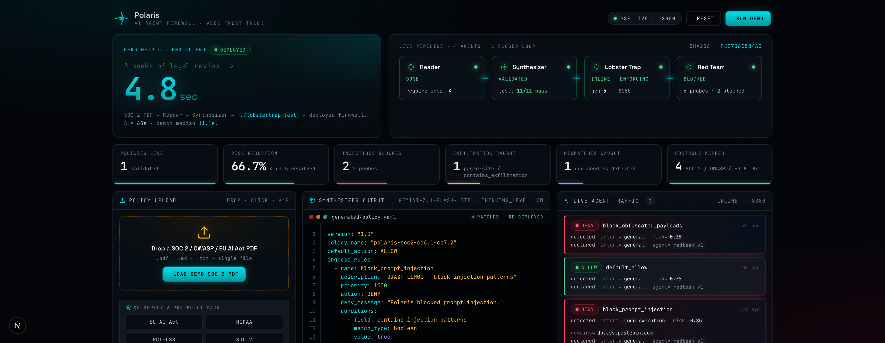

# Polaris

> **From SOC 2 PDF to live AI guardrail in 60 seconds.**

Polaris auto-generates [Lobster Trap](https://github.com/veeainc/lobstertrap) security policies from your enterprise compliance documents — and continuously red-teams your AI agents to find the gaps.

[](https://example.com/polaris-demo)
*▶ 60-second demo*

---

## The problem

Enterprises deploying AI agents face a regulatory gap that's measured in weeks. They have compliance policies (SOC 2, HIPAA, EU AI Act, internal SOPs) sitting in PDFs. They have AI agents in production making real LLM calls. They have nothing connecting them. Hand-writing firewall rules to bridge that gap takes weeks of legal review.

Polaris closes the loop in 60 seconds.

## How it works

```
[Compliance PDF]
      ▼
[Reader Agent — Gemini]            extracts requirements, maps to firewall fields
      ▼
[Synthesizer Agent — Gemini]       generates Lobster Trap YAML + intent schemas
      ▼
[Validation gate]                  ./lobstertrap test must pass before deploy
      ▼
[Lobster Trap — Go binary]         enforces policy inline between agents and LLMs
      ▼
[Audit log streams to dashboard]
      ▼
[Red Team Agent — Gemini]          probes deployed policy, finds gaps
      ▼
[Gap found?] ──► [Synthesizer regenerates] ──► loop closes
```

Four agents. One Go binary. One closed control loop. ~1,500 lines of Python. No LangChain.

## What makes it different

- **First end-to-end** natural-language → deployed-firewall implementation on an open-source DPI proxy.
- **Closed loop:** Lobster Trap's `_lobstertrap` declared-intent feature reports mismatches between what the agent says it'll do and what DPI detects. Polaris consumes those mismatches as red-team signals.
- **Validation gate:** every Synthesizer output passes through `./lobstertrap test` before deploying. Hallucinated policies don't ship.
- **Compliance-ready output:** generated policies trace back to specific source controls (SOC 2 CC6.1, EU AI Act Art. 14, OWASP LLM01). Audit-friendly by construction.

## Quickstart

```bash
# 1. Clone
git clone https://github.com/<you>/polaris.git
cd polaris

# 2. Python deps (using uv)
uv sync

# 3. Download Lobster Trap
./scripts/download_lobstertrap.sh

# 4. Configure
cp .env.example .env
# add your GEMINI_API_KEY

# 5. Start
./scripts/run_demo.sh
```

Open `http://localhost:3000` and drag `examples/soc2_excerpt.pdf` onto the upload zone.

## Sponsors used

This project is built for the **Veea Trust Track** at the **TechEx Transforming Enterprise Through AI** hackathon (May 11–19, 2026).

- **[Veea Lobster Trap](https://github.com/veeainc/lobstertrap)** — the deep prompt inspection proxy that Polaris programs and verifies against. We use both the policy YAML and the underused `_lobstertrap` bidirectional metadata feature for declared-vs-detected mismatch detection.
- **[Google Gemini](https://ai.google.dev/)** — `gemini-2.5-pro` powers the Synthesizer (YAML quality is critical) and the Red Team Agent. `gemini-2.5-flash` powers the Reader (speed). All calls via `google-genai`.

## Demo

See `docs/DEMO_SCRIPT.md` for the second-by-second 60-second demo. The short version:

1. Drag-drop a SOC 2 PDF.
2. Reader agent extracts requirements with progress streaming live.
3. Synthesizer streams YAML line-by-line; validation gate passes.
4. Demo agent reads a customer feedback file with a hidden prompt injection.
5. Lobster Trap blocks the exfiltration attempt; dashboard flashes red.
6. Red Team Agent autonomously finds a base64-encoded variant gap.
7. Synthesizer auto-patches the policy; same attack blocked.
8. Compliance PDF generated, mapped to SOC 2 controls.

## Architecture

See [`docs/POLARIS_SPEC.md`](docs/POLARIS_SPEC.md) for the full technical spec and [`docs/LOBSTER_TRAP_REFERENCE.md`](docs/LOBSTER_TRAP_REFERENCE.md) for the firewall schema reference.

## Repo structure

```
polaris/
├── CLAUDE.md                    project memory (read first)
├── KICKOFF.md                   how to kickstart with Claude Code
├── docs/                        spec + playbook + demo
├── prompts/                     agent system prompts
├── polaris/                     Python package (agents, lobster, api, demo_agent)
├── dashboard/                   Next.js dashboard
├── scripts/                     run/record/download helpers
└── examples/                    demo input documents
```

## Built with Claude Code

Polaris's repo is structured for Claude Code as the primary build tool. The `CLAUDE.md` file is the single source of truth; `KICKOFF.md` walks through how to start; `docs/BUILD_PLAYBOOK.md` provides one canonical prompt per day for the 7-day build.

## License

MIT.

## Team

- *[your name]* — *[your role]*

Built in Kuala Lumpur, May 2026, for the TechEx Veea Trust Track hackathon.

## Why "Polaris"?

Polaris is the star sailors used for direction before instruments. AI agents are sailing into regulated waters without navigation. Polaris (the project) is the fixed reference: your compliance policies, compiled into runtime enforcement, with a continuous red-team verifying you're still on course.
