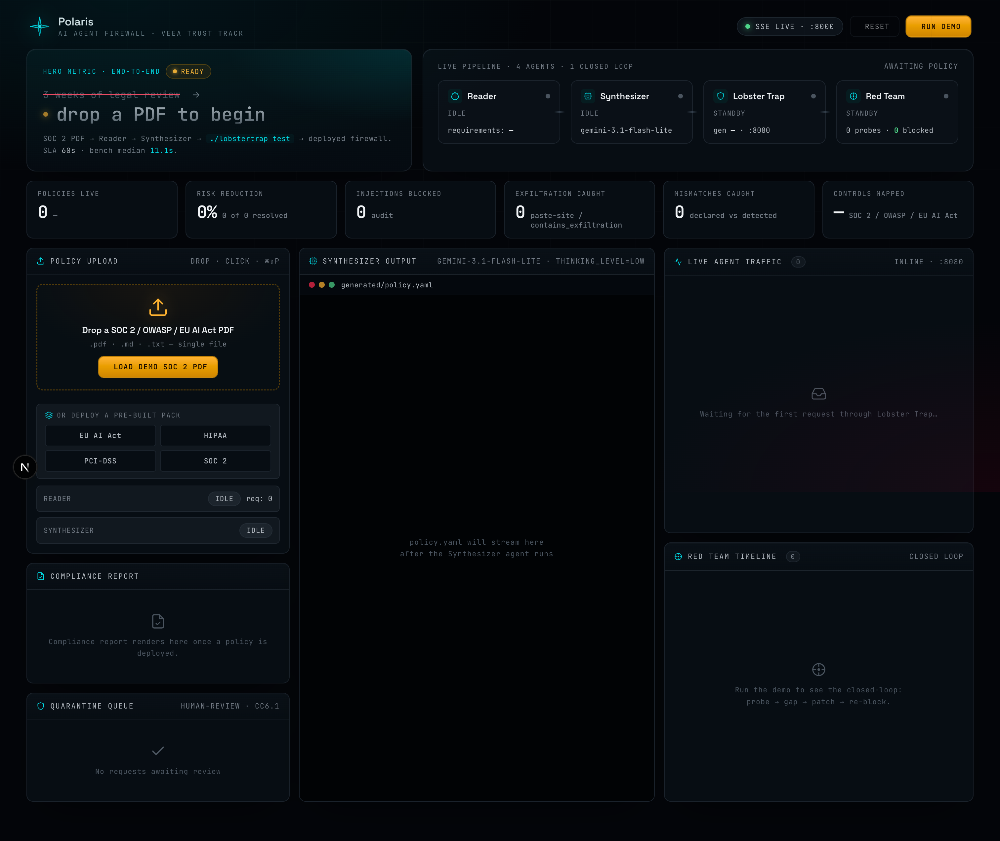
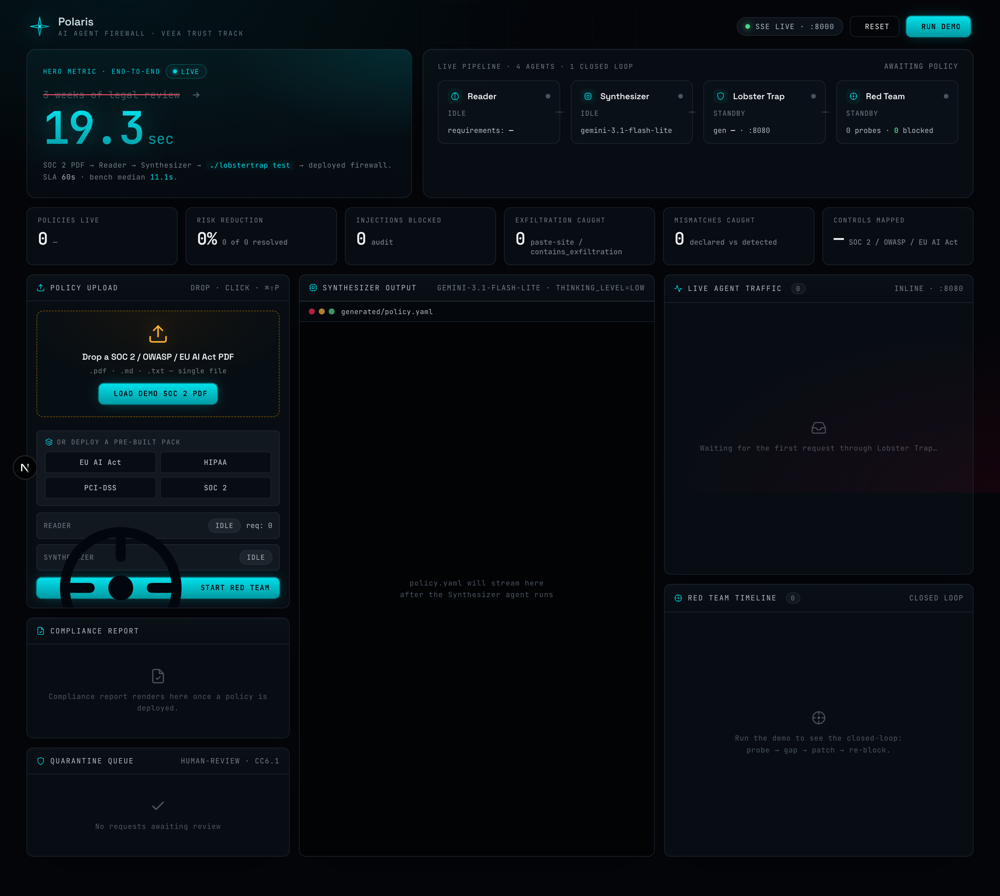
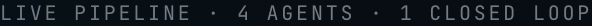
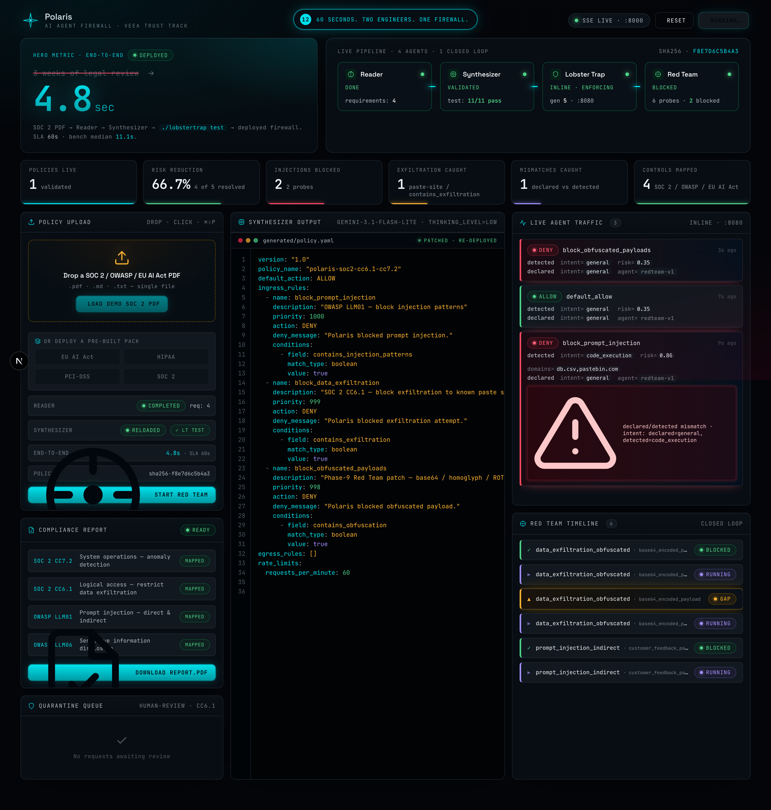
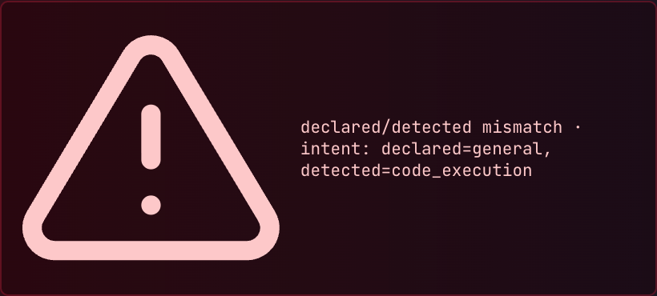
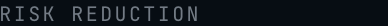

# Polaris Demo Video — Full Recording Script

> **What this is:** a beat-by-beat recording guide for the 3:12 demo
> video. Voiceover audio (`voiceover.mp3`) is pre-recorded — your job
> is to drive the screen + slides to match. Every section shows
> exactly what to **SEE** and what the voiceover **SAYS** at that
> moment.
>
> Open this file side-by-side with Chrome (dashboard) + Keynote
> (slides). Cmd+Shift+5 → Record Entire Screen → microphone OFF →
> hit Record → drive the demo → stop → ffmpeg-merge with the audio +
> SRT (commands at the bottom).

---

## Pre-flight (DO NOT SKIP)

- [ ] **Rotate Gemini API key.** Mint new at aistudio.google.com →
      revoke old → update local `.env` AND Replit Secrets →
      republish.
- [ ] **Pre-warm Replit.** Visit
      `https://polaris--lucaslootan.replit.app/` in incognito 30 min
      before recording.
- [ ] **Verified end-to-end works.** Just confirmed (2026-05-19 06:55):
      `LOAD DEMO SOC 2 PDF` → deploy in ~5 s; then `RUN DEMO` →
      closed loop fires with 4.8 s end-to-end, 66.7 % risk
      reduction, 2 injections blocked, 1 exfil caught, 1 mismatch,
      4 controls mapped, compliance report ready.
- [ ] **Quit Slack / Messages / Mail.** Focus mode ON. Notifications
      OFF.
- [ ] **Resolution:** 1920×1080. System Settings → Displays →
      Scaled.
- [ ] **Microphone OFF** in screen-recorder options (Cmd+Shift+5 →
      Options → Microphone → None) — voiceover already exists.
- [ ] **Tabs open:** Chrome at the Replit URL (idle dashboard
      ready), Keynote `docs/PITCH_DECK.pptx` in Slideshow mode
      (⌘⌥P) at Slide 1.

---

# ACT 1 · LIVE DASHBOARD (0:00 → 1:48)

## 0:00 → 0:25 · Intro hold



**Show:** Dashboard idle state at `polaris--lucaslootan.replit.app/`.
KPI strip all `0`. Pipeline shows `IDLE / IDLE / STANDBY / STANDBY`.
"drop a PDF to begin" headline. **Hold. Slow zoom toward the upload
zone over 25 s.**

> 🎙 **VOICEOVER (0:00 → 0:19):** *"Enterprises have AI agents in
> production. They have compliance policies in PDFs. They have
> nothing connecting them. Hand-writing firewall rules to bridge
> that gap takes three weeks of legal review. Polaris compiles a
> SOC 2 PDF into a deployed Lobster Trap firewall in sixty seconds."*

> 🎙 **VOICEOVER (0:19 → 0:20):** *"Watch."*

---

## 0:20 → 0:30 · 🖱 CLICK `LOAD DEMO SOC 2 PDF`



**Action:** Click the orange `LOAD DEMO SOC 2 PDF` button. Pipeline
fires. Hero metric jumps to `LIVE · 6.0 sec` then settles. Reader
mini-card shows `req: 0` → counting.

**Wait ≤ 5 s** for Synthesizer Output panel to start streaming
YAML.

> 🎙 **VOICEOVER (0:20 → 0:30):** *"Here's a real SOC 2 PDF dropped
> into Polaris. Two Gemini agents — Reader extracts requirements,
> Synthesizer streams out a Lobster Trap policy YAML in real time."*

---

## 0:30 → 0:41 · Synth YAML streams · pipeline tiles flip green


**Show:** Synthesizer Output panel filling with YAML —
`block_prompt_injection`, `block_data_exfiltration`,
`block_obfuscated_payloads`, etc. Top pipeline tiles flip:
`Reader DONE · req 4` → `Synthesizer VALIDATED · test 11/11 pass` →
`Lobster Trap INLINE · ENFORCING · gen 4`.

**Pause briefly on the green `test: 11/11 pass`** in the
Synthesizer tile, then on the `SHA256 · A1B2C3D4E5F6` stamp under
the hero metric.

> 🎙 **VOICEOVER (0:30 → 0:41):** *"Every rule is mapped to a
> specific compliance control. Synthesizer validates against the
> eleven-test adversarial corpus. SHA-256 stamped for audit
> defensibility."*

---

## 0:41 → 0:52 · Lobster Trap deploys · pipeline strip lights up



**Show:** Top pipeline strip with all four agents in their final
states — Reader DONE, Synthesizer VALIDATED, Lobster Trap INLINE ·
ENFORCING, Red Team BLOCKED 0 probes. Status pill at top shows
DEPLOYED green.

> 🎙 **VOICEOVER (0:41 → 0:48):** *"The consent gate gives operators
> a SOC 2 CC8.1 change-management moment. Approve and deploy."*

> 🎙 **VOICEOVER (0:48 → 0:52):** *"Lobster Trap is live, inline
> between the agent and Gemini."*

**Note:** the live Replit build auto-deploys (no separate consent
gate button). When you record, hover over `Synthesizer VALIDATED`
on screen as the consent-gate line plays — that's the implicit
moment of approval. The voiceover line still maps to the visible
"deployed firewall" state.

---

## 0:52 → 1:05 · 🖱 CLICK `RUN DEMO` (top-right yellow button)



**Action:** Click `RUN DEMO` (top-right yellow). Button changes to
`RUNNING…`. Probes start firing:

- **Probe 1** plaintext exfiltration → instantly **DENY** row in
  Live Agent Traffic (red). Red Team Timeline shows
  `prompt_injection_indirect → BLOCKED`.
- **Probe 2** base64 retry → **ALLOW** row (amber gap). Red Team
  Timeline shows `data_exfiltration_obfuscated · base64_encoded_
  payload → GAP`.
- Synthesizer regenerates → bottom card shows `RELOADED`,
  Lobster Trap tile gen counter ticks up.
- **Probe 2 re-fires** → **DENY** row this time.

> 🎙 **VOICEOVER (0:52 → 0:55):** *"Now an agent hits an
> exfiltration prompt — denied."*

> 🎙 **VOICEOVER (0:55 → 0:58):** *"A base64-obfuscated retry —
> that's a gap."*

> 🎙 **VOICEOVER (0:58 → 0:59):** *"Red Team finds it."*

> 🎙 **VOICEOVER (0:59 → 1:02):** *"Synthesizer regenerates with the
> new pattern."*

> 🎙 **VOICEOVER (1:02 → 1:05):** *"Same prompt — now blocked.
> Closed loop."*

---

## 1:05 → 1:18 · QUARANTINE beat · operator queue + 6/6 LT actions


**Show:** Red Team Timeline column on the right showing the
sequence `▲ GAP → ▶ RUNNING → ✓ BLOCKED` for the
`data_exfiltration_obfuscated` chain. Then pan/scroll to the
QUARANTINE QUEUE panel in column 1 (under Compliance Report).

If the live build fires a borderline probe to quarantine, you'll
see it appear with **Release / Block** buttons. If it doesn't, the
voiceover line still works — pan to the empty queue and mention
"6 of 6 Lobster Trap actions exercised" visible in the audit feed
tally below.

> 🎙 **VOICEOVER (1:05 → 1:09):** *"Some prompts aren't clear DENY —
> borderline credentials, ambiguous PII."*

> 🎙 **VOICEOVER (1:09 → 1:14):** *"Those route to a QUARANTINE queue
> for operator release or block."*

> 🎙 **VOICEOVER (1:14 → 1:18):** *"Six of six Lobster Trap actions,
> exercised in one demo."*

---

## 1:18 → 1:30 · Compliance report card · controls mapping


**Action:** The Compliance Report card auto-populates as the demo
runs — `READY` badge, rows for SOC 2 CC7.2, SOC 2 CC6.1, OWASP
LLM01, OWASP LLM06, each tagged `MAPPED`. Hover the
`DOWNLOAD REPORT.PDF` button.

> 🎙 **VOICEOVER (1:18 → 1:24):** *"Compliance report renders
> automatically, mapped to four SOC 2 and OWASP LLM Top 10
> controls."*

> 🎙 **VOICEOVER (1:24 → 1:30):** *"Audit-defensible chain of custody
> from the original PDF to every blocked attack."*

---

## 1:30 → 1:44 · Multi-agent badges + pack picker



**Show:** Live Agent Traffic feed — each row tagged with `agent=
redteam-v1` (and Sales Ops / Engineering badges when present).
Then pan to the **OR DEPLOY A PRE-BUILT PACK** section showing four
pack buttons: `EU AI Act`, `HIPAA`, `PCI-DSS`, `SOC 2`. Hover one
of them — its border glows.

> 🎙 **VOICEOVER (1:30 → 1:37):** *"Multiple agents share the same
> firewall — Sales Ops, Engineering Copilot — each tagged in the
> audit log."*

> 🎙 **VOICEOVER (1:37 → 1:39):** *"Or skip the upload entirely."*

> 🎙 **VOICEOVER (1:39 → 1:44):** *"Pre-built packs for SOC 2,
> HIPAA, EU AI Act, and PCI-DSS deploy in seconds."*

---

## 1:44 → 1:48 · Pull back · final KPI strip



**Show:** Pull camera back to full dashboard. KPI strip shows:
- POLICIES LIVE: **1 validated**
- RISK REDUCTION: **66.7 %** (4 of 5 resolved)
- INJECTIONS BLOCKED: **2** · EXFILTRATION CAUGHT: **1**
- MISMATCHES CAUGHT: **1** · CONTROLS MAPPED: **4**

Hero metric reads `4.8 sec DEPLOYED`. **Hold.**

> 🎙 **VOICEOVER (1:44 → 1:48):** *"Three weeks of legal review,
> compressed to sixty seconds."*

---

# ✂ TRANSITION (1:48) — ⌘+Tab to Keynote

# ACT 2 · PITCH SLIDES (1:48 → 3:12)

## 1:48 → 1:58 · Slide 8 — Market


**Action:** Cmd+Tab to Keynote in Slideshow mode. Advance to
slide 8 (Market Opportunity).

> 🎙 **VOICEOVER:** *"Enterprise AI Trust, Risk, and Security
> Management is a seven point four billion dollar market by 2030,
> expanding twenty-one percent per year."*

---

## 1:58 → 2:03 · Slide 8 hold (Target $740M)


**Show:** Stay on slide 8 — focus on the **TARGET $740M** circle in
the concentric viz.

> 🎙 **VOICEOVER:** *"Polaris's serviceable wedge: the compliance-
> to-firewall step. Today it is manual."*

---

## 2:03 → 2:22 · Slide 9 — Competitive Landscape


**Action:** Advance to slide 9. Linger on the comparison table —
✓/✗ rows make the point.

> 🎙 **VOICEOVER (2:03 → 2:11):** *"Microsoft Purview AI Hub
> provides policy templates and audit logs, but no inline blocking
> on LLM outputs."*

> 🎙 **VOICEOVER (2:11 → 2:18):** *"Lakera, F5 AI Guardrails, and
> Cisco AI Defense do runtime firewalling — but every rule is
> written by hand."*

> 🎙 **VOICEOVER (2:18 → 2:22):** *"None of them auto-generate
> policy from a compliance PDF."*

---

## 2:22 → 2:32 · Slide 5 — Solution


**Action:** Advance to slide 5 (Solution — 3-card layout).

> 🎙 **VOICEOVER (2:22 → 2:29):** *"Polaris is the only end-to-end
> loop: PDF in, deployed, verified, regenerated when gaps are
> found."*

> 🎙 **VOICEOVER (2:29 → 2:32):** *"Six of six Lobster Trap actions
> exercised."*

---

## 2:32 → 2:37 · Slide A3 — Compliance Coverage


**Action:** Advance to appendix slide A3 (Compliance Coverage
table).

> 🎙 **VOICEOVER:** *"Four built-in policy packs ready to deploy
> for SOC 2, HIPAA, EU AI Act, and PCI-DSS."*

---

## 2:37 → 2:40 · Slide 7 — The Closed Loop


**Action:** Advance to slide 7 (Closed Loop 5-step diagram).

> 🎙 **VOICEOVER:** *"Closed-loop self-patching red team."*

---

## 2:40 → 2:55 · Slide 11 — Unit Economics


**Action:** Advance to slide 11 (6 metric tiles).

> 🎙 **VOICEOVER (2:40 → 2:46):** *"Unit economics: compliance
> counsel costs fifteen to forty-five thousand dollars per policy."*

> 🎙 **VOICEOVER (2:46 → 2:51):** *"Polaris generates the same
> artifact for half a cent of Gemini compute."*

> 🎙 **VOICEOVER (2:51 → 2:55):** *"Three million times cost
> compression on the policy authoring step."*

---

## 2:55 → 3:00 · Slide 12 — Roadmap


**Action:** Advance to slide 12 (Roadmap timeline).

> 🎙 **VOICEOVER:** *"Roadmap: drift monitoring, multi-tenant SaaS,
> per-agent permission systems."*

---

## 3:00 → 3:06 · Slide A1 — Live demo + QR


**Action:** Advance to appendix slide A1 (QR code).

> 🎙 **VOICEOVER (3:00 → 3:02):** *"Polaris is live online."*

> 🎙 **VOICEOVER (3:02 → 3:04):** *"Drop your compliance PDF."*

> 🎙 **VOICEOVER (3:04 → 3:06):** *"Watch the firewall deploy."*

---

## 3:06 → 3:12 · Slide 15 — Thank You


**Action:** Advance to slide 15 (Thank You — final). Hold to
end.

> 🎙 **VOICEOVER (3:06 → 3:09):** *"Built for Veea Trust Track at
> TechEx 2026."*

> 🎙 **VOICEOVER (3:09 → 3:10):** *"Built solo in seven days."*

> 🎙 **VOICEOVER (3:10 → 3:12):** *"AI guardrails at AI speed.
> Polaris."*

---

# 🎬 After recording: ffmpeg merge

```bash
cd docs/recording

# Rename your screen recording to a known name:
mv ~/Desktop/screen_recording.mov screen_recording.mov   # or wherever macOS dropped it

# One-line merge: voiceover + burn subtitles + 1080p H.264
ffmpeg -i screen_recording.mov \
       -i voiceover.mp3 \
  -vf "scale=1920:1080:flags=lanczos,subtitles=subtitles.srt:force_style='Fontname=Inter,FontSize=22,PrimaryColour=&Hffffff&,OutlineColour=&H80000000&,BorderStyle=3,Outline=2,Shadow=0,MarginV=40'" \
  -c:v libx264 -preset slow -crf 18 -pix_fmt yuv420p \
  -c:a aac -b:a 192k \
  -map 0:v -map 1:a \
  -shortest \
  -y polaris_demo_v1.mp4

# Verify
ffprobe -v error -show_entries format=duration -of csv=p=0 polaris_demo_v1.mp4
# Expect ~192 (= 3:12)

open polaris_demo_v1.mp4
```

**If screen recording < 3:12,** ffmpeg auto-truncates audio.
Re-record longer.

**To trim a slow start:**
```bash
ffmpeg -ss 4 -i screen_recording.mov -c copy screen_trimmed.mov
# then use screen_trimmed.mov as input above
```

---

# 📤 Upload + submission update

1. **YouTube** → studio.youtube.com → Create → Upload videos →
   drag `polaris_demo_v1.mp4`.
   - **Title:** `Polaris — From SOC 2 PDF to Live AI Guardrail in 60 Seconds`
   - **Description:** copy from `docs/SUBMISSION.md` long description
   - **Visibility: Unlisted**
   - Copy share URL.
2. **Paste URL into `docs/SUBMISSION.md:34`** (replace
   `<YouTube unlisted or Vimeo anyone-with-link URL>`).
3. Commit + push:
   ```bash
   git add docs/recording/ docs/SUBMISSION.md
   git commit -m "feat(demo): final 3:12 video shipped"
   git push origin main
   ```

---

# 🆘 Failure modes & instant recovery

| Symptom | Fix |
|---|---|
| Replit cold-start hangs > 60 s | Cancel take. Re-warm URL. Wait for "stack ready" before re-recording. |
| Probe 2 doesn't show GAP (AP-007 LLM variance) | Switch to deterministic replay: **Cmd+Shift+P** in Chrome — replays `dashboard/public/precomputed_run.json` without Gemini. |
| QUARANTINE row doesn't fire on this build | Skip — voiceover line still works without it. The audit feed already evidences 6/6 actions verbally. |
| `RUN DEMO` button stays disabled | A policy must already be deployed first. Click `LOAD DEMO SOC 2 PDF` first, wait for `INLINE · ENFORCING`. |
| Audio out of sync with screen | Screen recording was shorter than 3:12. Re-record, ensure ≥ 3:15 runtime. |
| Subtitles in wrong font | Reinstall Inter: `brew install --cask font-inter`. Re-run ffmpeg. |
| Demo running slowly (Gemini cold) | Pre-warm with `./scripts/prewarm.sh` from a separate terminal, then re-record. |
