# Polaris — Presentation Script (slide-by-slide)

> **How to use:** open `docs/PITCH_DECK.pptx` in Keynote Slideshow mode
> (⌘⌥P). For each slide, read the highlighted **SAY** block aloud at a
> comfortable conversational pace (~150-160 wpm). Advance with → arrow
> key when the timer says.
>
> **Total core spoken time: ~5:00** (slides 1–15). Appendix slides A1–A3
> are reserved for Q&A — only show if a judge asks.
>
> **Pace target:** unhurried but not slow. If you finish a slide's text
> early, hold on the slide for a beat before advancing.

---

## Slide 1 — Cover  ·  10 seconds

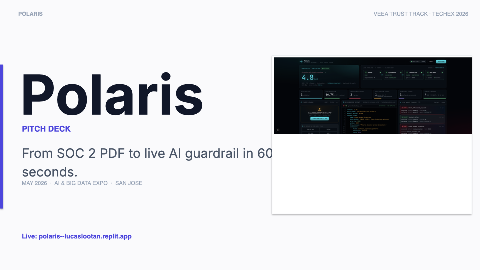

> **SAY:** Polaris. From SOC 2 PDF to live AI guardrail in 60 seconds.
> Built for the Veea Trust Track at TechEx 2026. Let me show you why
> this matters.

---

## Slide 2 — Mission  ·  15 seconds

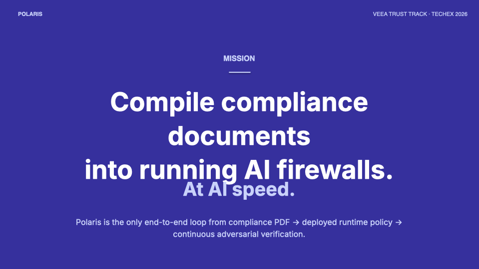

> **SAY:** Our mission is simple. Compile compliance documents into
> running AI firewalls. At AI speed. Today every enterprise has AI
> agents in production, and compliance policies sitting in PDFs.
> Nothing connects them. Polaris is the loop that closes that gap.

---

## Slide 3 — Overview  ·  20 seconds

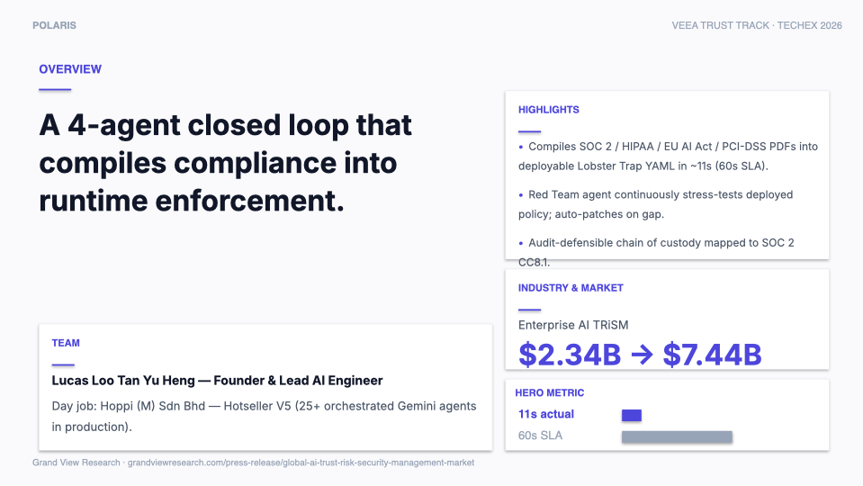

> **SAY:** Here's Polaris in one slide. A four-agent closed loop. It
> compiles SOC 2, HIPAA, EU AI Act, and PCI-DSS PDFs into deployable
> Lobster Trap firewall policies — in about eleven seconds against
> our sixty-second SLA. A Red Team agent continuously stress-tests
> the deployed policy and auto-patches when gaps are found.

---

## Slide 4 — The Problem + Why Now  ·  35 seconds

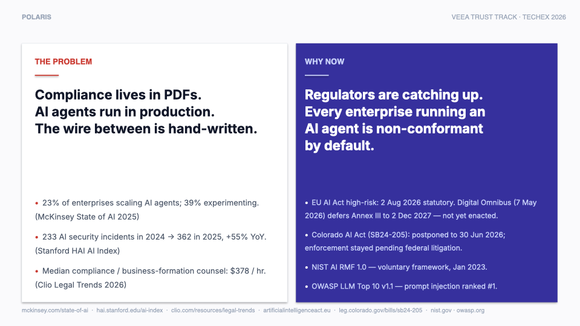

> **SAY:** Two facts every CISO already knows. *(Point to left
> panel.)* The problem — compliance lives in PDFs, AI agents run in
> production. McKinsey says twenty-three percent of enterprises are
> already scaling agents. AI security incidents grew fifty-five
> percent year-over-year per Stanford's AI Index. And the people who
> bridge compliance to enforcement — compliance counsel — bill at
> about three hundred and seventy-eight dollars an hour.
>
> *(Point to right panel.)* And why now — regulators are catching
> up. EU AI Act high-risk obligations take effect August 2026.
> Colorado AI Act is enacted but enforcement stayed pending
> litigation. NIST has the Risk Management Framework. OWASP ranks
> prompt injection number one. Every enterprise running an AI agent
> today is non-conformant by default.

---

## Slide 5 — The Solution  ·  25 seconds

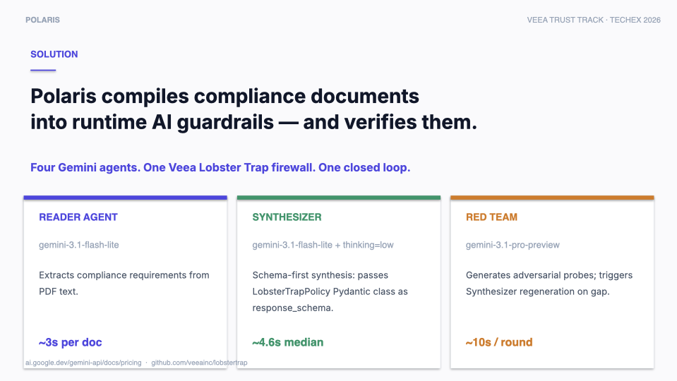

> **SAY:** Polaris is four Gemini agents and one Veea Lobster Trap
> firewall. *(Point to cards as you go.)* Reader Agent — extracts
> compliance requirements from PDF text. About three seconds.
> Synthesizer Agent — uses schema-first generation, passes a Pydantic
> class as Gemini's response_schema. Generates Lobster Trap YAML in
> 4.6 seconds median. Red Team Agent — generates adversarial probes,
> finds gaps, triggers Synthesizer regeneration. About ten seconds
> per round.

---

## Slide 6 — Product close-up  ·  15 seconds

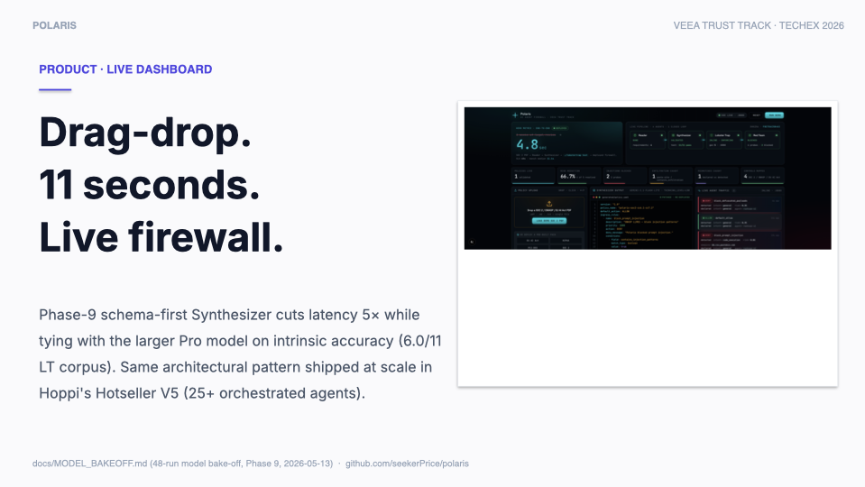

> **SAY:** This is the dashboard. Drag a SOC 2 PDF, eleven seconds
> later your firewall is live and protecting your AI agent. The
> architecture pattern is the same one I shipped at scale in Hoppi's
> Hotseller V5 — twenty-five orchestrated Gemini agents in
> production today.

---

## Slide 7 — The Closed Loop  ·  30 seconds

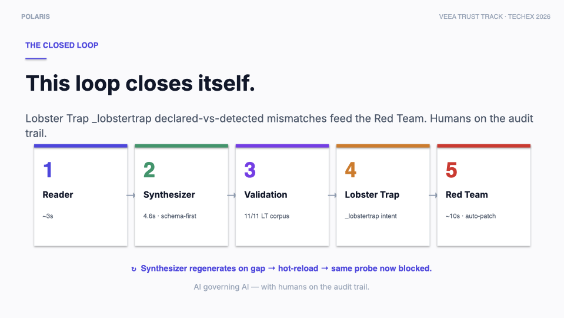

> **SAY:** Here's what makes Polaris different. Five-step loop. *(Walk
> across the boxes.)* Reader extracts. Synthesizer generates and
> validates against an eleven-test adversarial corpus. Lobster Trap
> deploys inline as a deep-packet-inspection proxy. Red Team
> continuously probes. When a probe gets through, Synthesizer
> regenerates the policy and Lobster Trap hot-reloads — no redeploy
> needed. AI governing AI, with humans on the audit trail.

---

## Slide 8 — Market Opportunity  ·  25 seconds

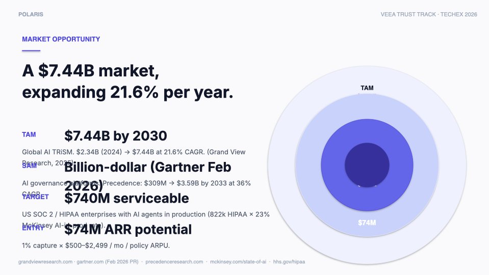

> **SAY:** Market sizing. Total addressable market — Enterprise AI
> Trust, Risk, and Security Management. 7.44 billion dollars by
> 2030, growing 21 percent per year, per Grand View Research.
> Serviceable addressable market — AI governance platforms — Gartner
> calls this a billion-dollar market in their February 2026 release.
> Our target wedge is U.S. enterprises subject to SOC 2 or HIPAA
> with AI agents in production — roughly 740 million in policy spend.
> One percent capture equals 74 million ARR.

---

## Slide 9 — Competitive Landscape  ·  30 seconds

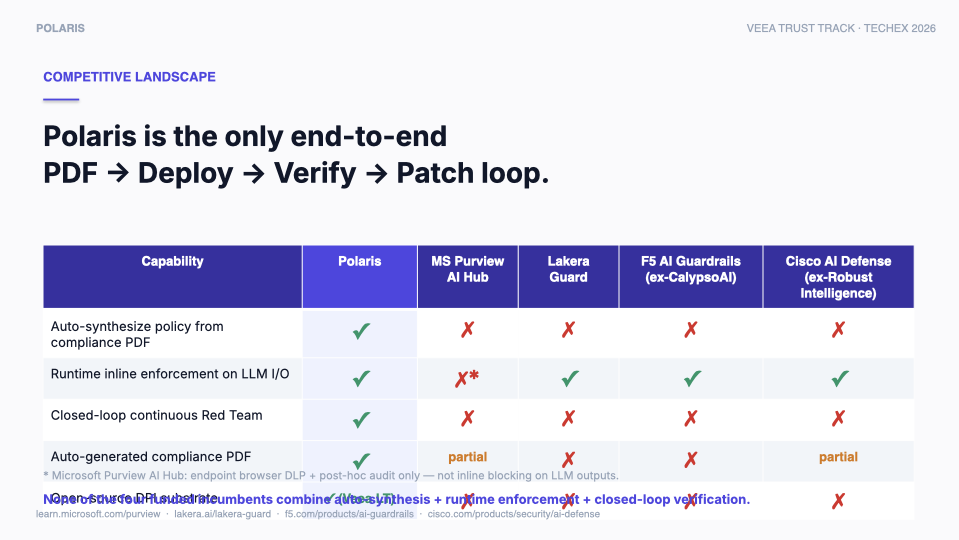

> **SAY:** Five competitors. *(Point to table.)* Microsoft Purview AI
> Hub does policy templates and audit logs — no inline blocking on
> LLM outputs. Lakera Guard, F5 AI Guardrails formerly CalypsoAI,
> and Cisco AI Defense formerly Robust Intelligence — they do
> runtime firewalling, but every rule is written by hand. Crucially,
> none of them auto-generate policy from a compliance PDF, and none
> close the verification loop. Polaris is the only end-to-end
> PDF-to-deploy-to-verify-to-patch loop.

---

## Slide 10 — Business Model  ·  25 seconds

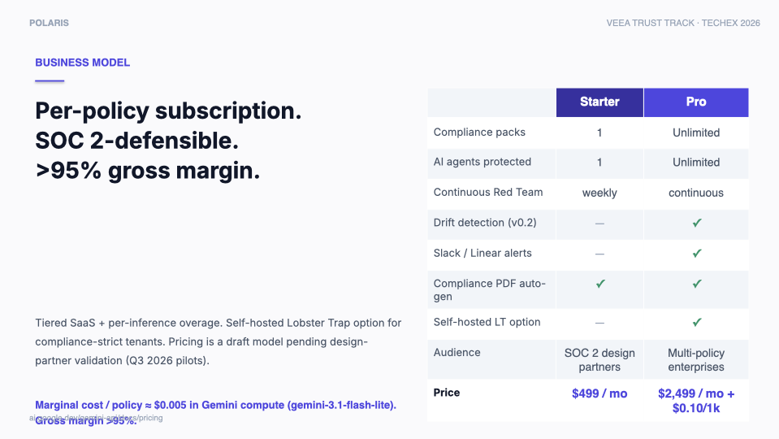

> **SAY:** Pricing — draft, pending design-partner validation in
> Q3. Starter at 499 dollars a month — one compliance pack, one
> agent. Pro at 2,499 a month plus ten cents per thousand inferences
> — unlimited packs and agents, drift detection, Slack and Linear
> alerts, self-hosted Lobster Trap option. Marginal cost per policy
> synthesis is half a cent in Gemini compute. Gross margin over 95
> percent.

---

## Slide 11 — Unit Economics  ·  25 seconds

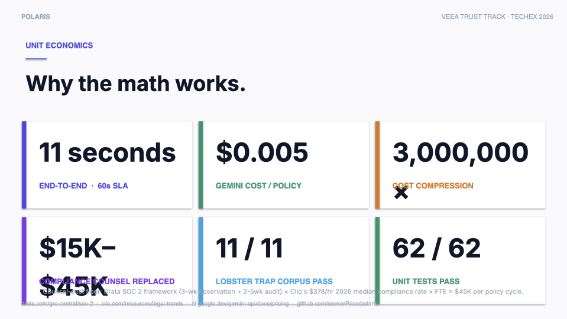

> **SAY:** Six numbers. Eleven seconds end-to-end against a sixty-
> second SLA. Half a cent per policy in Gemini compute. Three million
> times cost compression versus manual baseline. Fifteen to forty-
> five thousand dollars of compliance counsel replaced per policy
> review cycle. Eleven of eleven on the Lobster Trap adversarial
> corpus. Sixty-two of sixty-two unit tests pass.

---

## Slide 12 — Roadmap  ·  25 seconds

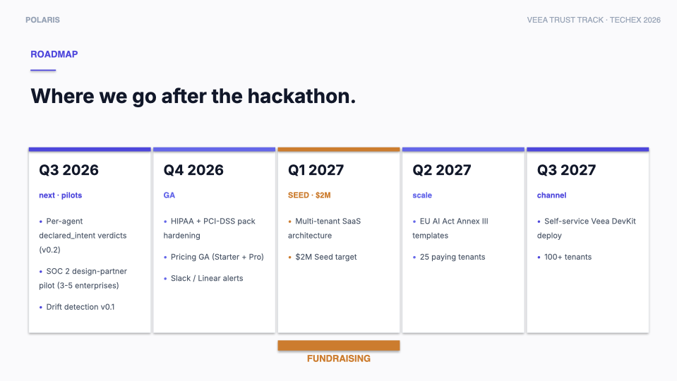

> **SAY:** Roadmap, five quarters. Q3 2026 — SOC 2 design-partner
> pilot with three to five enterprises, multi-agent isolation v0.2,
> drift detection v0.1. Q4 — HIPAA and PCI-DSS pack hardening,
> pricing GA. Q1 2027 is the fundraising bar — two million dollar
> seed and multi-tenant SaaS. Q2 — EU AI Act Annex III templates,
> twenty-five paying tenants. Q3 — self-service Veea DevKit deploy,
> hundred-plus tenants.

---

## Slide 13 — Team  ·  20 seconds

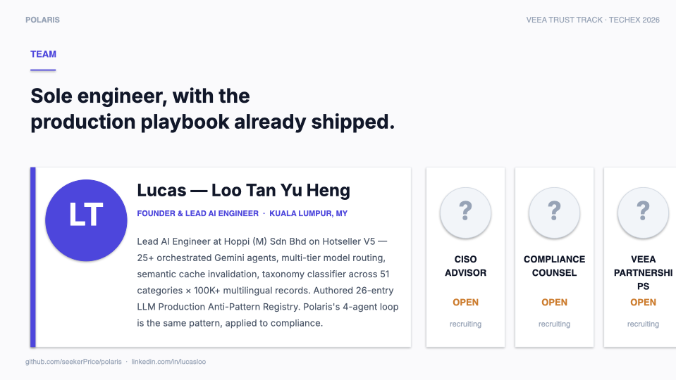

> **SAY:** Solo engineer. I'm Lucas Loo, Founder and Lead AI
> Engineer at Hoppi on Hotseller V5 — twenty-five orchestrated
> Gemini agents in production, multi-tier model routing, taxonomy
> classifier across fifty-one categories and a hundred thousand
> multilingual records. Polaris's four-agent closed loop is the same
> architectural pattern, applied to compliance. Three open advisor
> seats — CISO, compliance counsel, Veea partnerships.

---

## Slide 14 — The Ask  ·  20 seconds

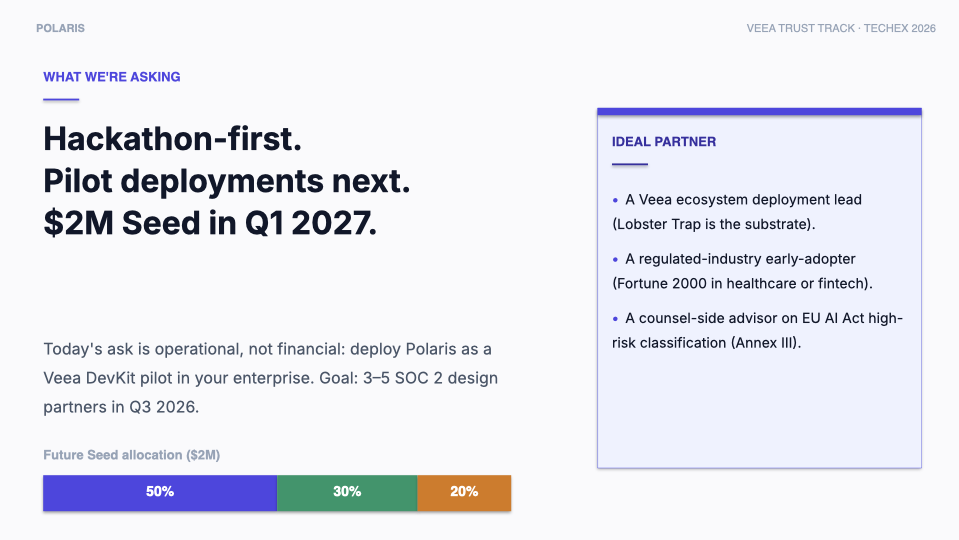

> **SAY:** What we're asking today. Hackathon first. Pilot
> deployments next. Two million seed in Q1 2027. The ask today is
> operational, not financial — deploy Polaris as a Veea DevKit pilot
> in your enterprise. Ideal partner — a Veea ecosystem deployment
> lead, a regulated-industry early adopter in healthcare or fintech,
> and a counsel-side advisor on EU AI Act high-risk classification.

---

## Slide 15 — Thank You  ·  15 seconds

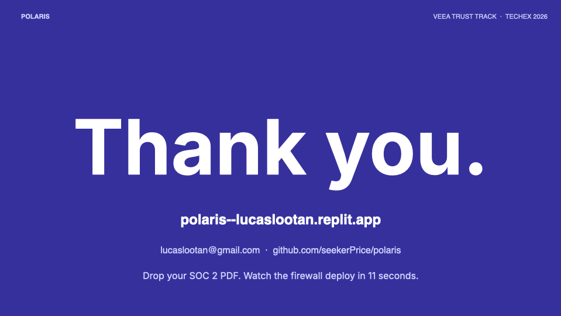

> **SAY:** Thank you. Polaris is live online — the URL is on the
> slide and the QR code is in the next slide for anyone who wants to
> try it. Drop your compliance PDF, watch the firewall deploy in
> eleven seconds. Built for the Veea Trust Track at TechEx 2026.
> Built solo in seven days. AI guardrails at AI speed. Questions?

---

## ★ Total core: ~5:00 (slides 1–15)

---

# Appendix — for Q&A only

## A1 — Live demo + QR  ·  10 seconds *(if asked: "can we try it?")*

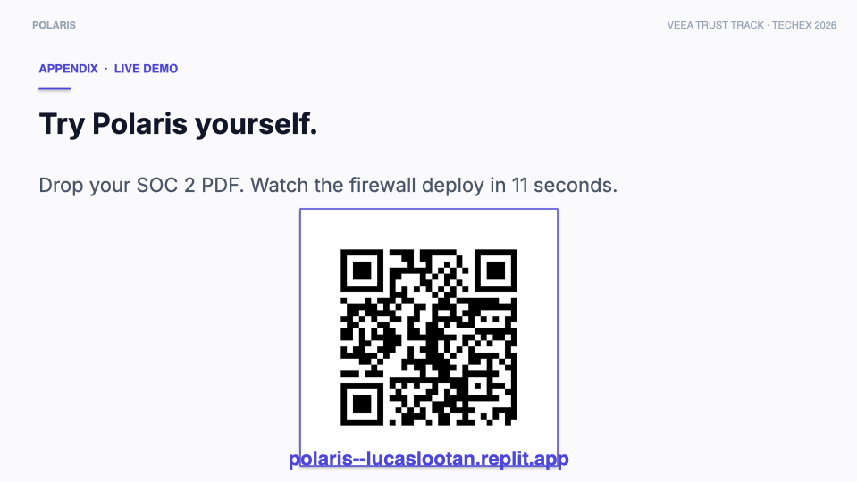

> **SAY:** Scan the QR. It runs the same flow in your browser. Drop
> a SOC 2 PDF, watch the firewall deploy. The Replit hosts a fresh
> container per visit so each judge sees a clean run.

---

## A2 — Architecture  ·  30 seconds *(if asked: "how does the loop actually work?")*

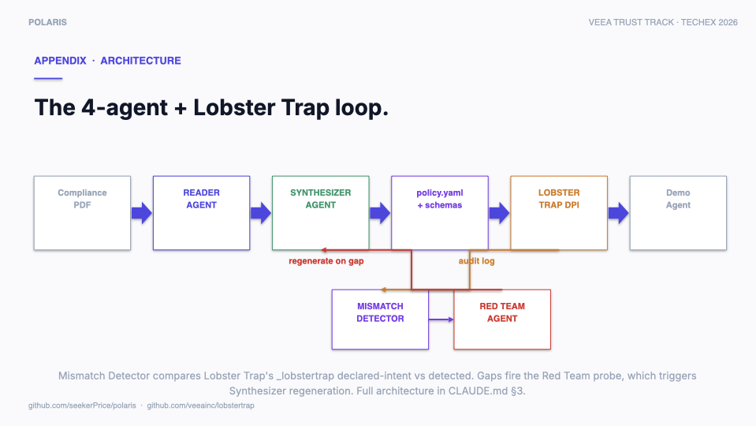

> **SAY:** The closed loop in detail. *(Walk the diagram.)* PDF in.
> Reader Agent extracts requirements. Synthesizer Agent generates
> YAML and validates against the adversarial corpus. Lobster Trap
> deploys inline as a DPI proxy in front of the Demo Agent. *(Trace
> the loop-back arrows.)* Lobster Trap logs every request to a
> Mismatch Detector, which compares Lobster Trap's `_lobstertrap`
> declared-intent against the detected intent in the request body.
> Mismatches fire the Red Team Agent, which generates adversarial
> probes. Successful probes trigger Synthesizer regeneration —
> closed loop, audit-defensible.

---

## A3 — Compliance control mapping  ·  30 seconds *(if asked: "how does this map to actual frameworks?")*

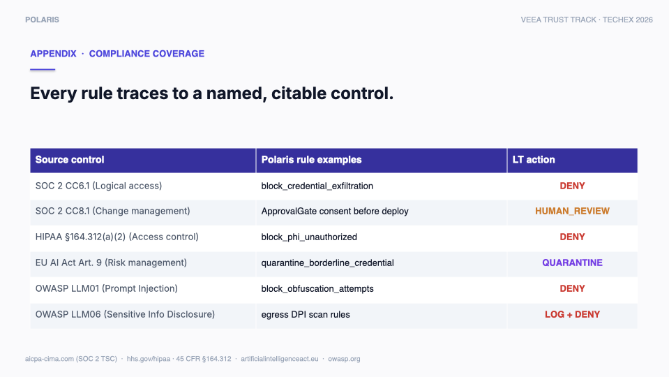

> **SAY:** Every Polaris rule traces back to a named, citable
> control. SOC 2 CC6.1 logical access maps to `block_credential_
> exfiltration`. CC8.1 change management maps to the operator consent
> gate. HIPAA section 164.312 access control maps to
> `block_phi_unauthorized`. EU AI Act Article 9 risk management
> maps to `quarantine_borderline_credential`. OWASP LLM01 prompt
> injection maps to `block_obfuscation_attempts`. LLM06 sensitive-
> info-disclosure maps to egress DPI scan rules. Six of six Lobster
> Trap action types exercised.

---

# Pacing notes

- Read slowly. Resist the urge to rush. Judges absorb sourced numbers
  better when the speaker is calm.
- Pause one beat after each number on slides 8 and 11 — let them
  register.
- If you finish a slide's text before the time budget, hold on the
  slide. Advancing too fast hurts comprehension.
- If you're running long, drop slide 6 (Product close-up) or slide
  13 (Team) — both can be trimmed to 10s without losing the pitch.

# Memory cues (when you blank)

| Slide | One-word memory anchor |
|-------|------------------------|
| 1 | *Sixty seconds* |
| 2 | *Mission · AI speed* |
| 3 | *Four agents · eleven seconds* |
| 4 | *PDFs vs production · regulators catching up* |
| 5 | *Reader · Synthesizer · Red Team* |
| 6 | *Eleven seconds · same as Hoppi pattern* |
| 7 | *Closed loop · AI governing AI* |
| 8 | *7.44 billion · 21 percent CAGR* |
| 9 | *No one combines all three* |
| 10 | *95 percent margin* |
| 11 | *Three million times compression* |
| 12 | *Q1 2027 seed · two million* |
| 13 | *Solo · Hotseller V5 pattern* |
| 14 | *Operational ask, not financial* |
| 15 | *AI guardrails at AI speed* |
